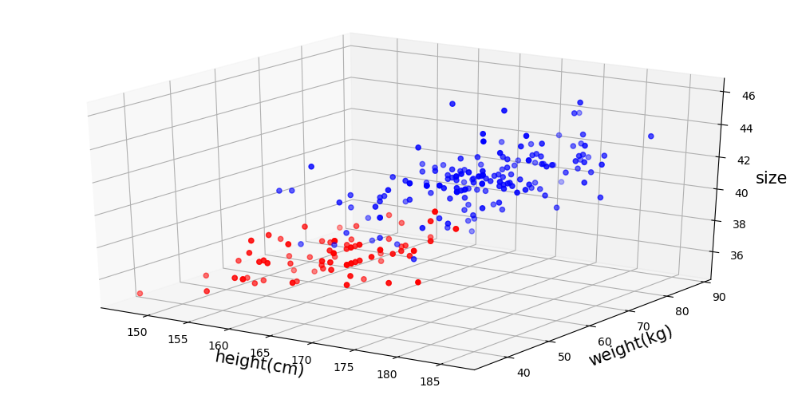
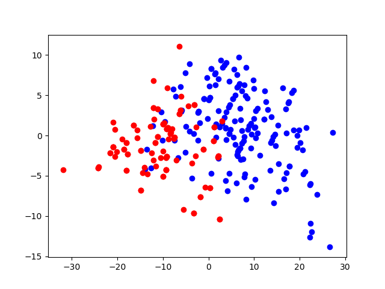

#<center>实验5: pca特征提取</center>

##<p align="right">17123075 李龙旭</p>
__算法流程__
>1.对原数据集零均值化
>2.求出均值化X的协方差矩阵
>3.求这个协方差矩阵的特征值和特征向量
>4.把特征值排序 移除协方差矩阵中特征值最小的那一列
>5.计算出降维后的数据 将数据映射到新空间后返回

原始数据的分布图



降维后数据的分布图



分类|错误率
-|-|
原始数据|0.050542
pca|0.129964


附代码:

```
from numpy import *
import matplotlib.pyplot as plt
import collections
from sklearn.decomposition import PCA
import xlrd
from mpl_toolkits.mplot3d import Axes3D
from sklearn.naive_bayes import GaussianNB

def readdata(file):
    fr = open(file)
    data=[]
    for line in fr.readlines():
        s = line.strip().split('\t')
        temp =[]
        for num in s:
            temp.append(float(num))
        data.append(temp)
    return mat(data)

def readtar(file):
    fr = open(file)
    tar = []
    for line in fr.readlines():
        tar.append(int(line))
    return tar

def pca(data):

    zero = data - mean(data,axis=0) #零均值化
    covdata = cov(zero,rowvar=False) #求出协方差矩阵
    w,v = linalg.eig(covdata) #求出协方差矩阵的特征值和特征向量
    pos = argsort(-w) #对特征值进行排序 添加-以得到从大到小的下标
    v = v[:,pos[:2]] #将特征值最小的列移除
    ans = zero * v #得到降维后的数据
    remat = (ans * v.T) + mean(data,axis=0) #将降维后的数据映射回原始空间
    return array(ans),remat


def draw3(data):
    fig = plt.figure(figsize=(10, 5))
    ax = Axes3D(fig)
    ax.scatter(data[:165, 0], data[:165, 1], data[:165, 2], color = 'blue')
    ax.scatter(data[165:, 0], data[165:, 1], data[165:, 2], color = 'red')    
    ax.set_xlabel('height(cm)', fontdict={'size': 15})
    ax.set_ylabel('weight(kg)', fontdict={'size': 15})
    ax.set_zlabel('size', fontdict={'size': 15})
    plt.show()


def draw2(data):
    plt.scatter(data[:165,0] , data[:165,1] ,c='b',lw=1)
    plt.scatter(data[165:,0] , data[165:,1] ,c='r',lw=1)
    plt.show()


if __name__=='__main__':
    mat = readdata('data.txt')
    tar = readtar('tar.txt')
    data = mat[:,0:3]
    ans,redata = pca(data)
    
    #draw3(mat)
    #draw2(ans)

    clf = GaussianNB()
    clf = clf.fit(array(redata),tar)
    pred = clf.predict(array(redata))
    
    print("错误率: %d/%d = %f" % ((pred!=tar).sum(),len(tar),(pred!=tar).sum()/len(tar)))
